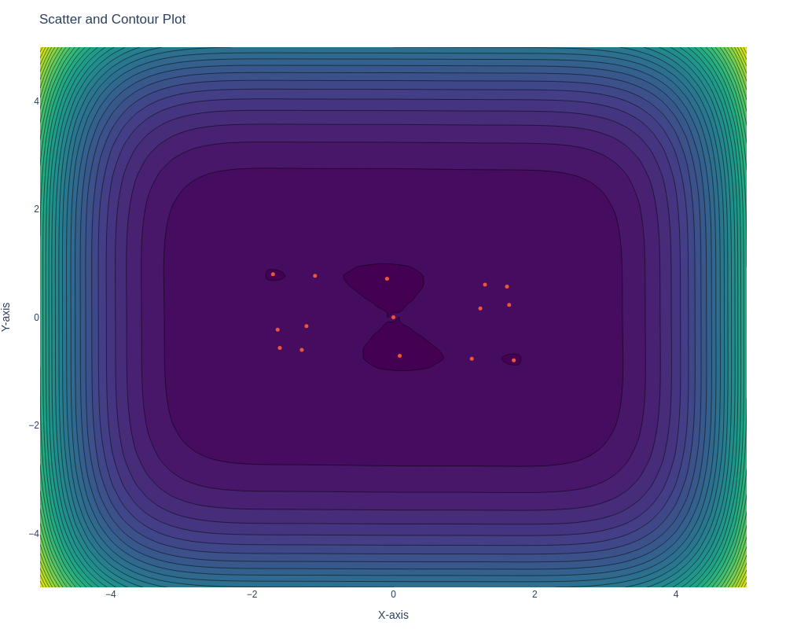

[Globtim](https://gitlab.lip6.fr/ghscholt/globtim) is a Julia package for solving global optimization problems via polynomial approximations.

For this method to work, we only require access to evaluations of the objective function `f`.

We call this method global because we seek to compute all local minimizers of the objective function `f`, a real continuous function defined over some given rectangular domain in $$\mathbb{R}^n$$.

Our method is carried out in three main steps:

1. The input function `f` is sampled on a tensorized Chebyshev grid.
2. A polynomial approximant is constructed via a discrete least squares.
3. The polynomial system of Partial derivatives is solved with either a homotopy continuation method (numerical) or through an exact polynomial system solving (symbolic) method.

## Example

Here we consider the Trefethen function from the Problem 4 of the [100 Digit challenge](https://en.wikipedia.org/wiki/Hundred-dollar,_Hundred-digit_Challenge_problems).

$$ f(x, y) = \exp(\sin(50 x)) + \sin(60 \exp(y)) + \sin(70 \sin(x)) + \sin(\sin(80 y)) - \sin(10 (x + y)) + (x^2 + y^2) / 4 $$

This function has about $$2720$$ critical points in $$ [-1, 1]^2 $$, which is slightly too much for us, at least for the moment, hence we subdivide the domain.

<iframe src="/assets/plotly/trefethen_function_plot.html" width="100%" height="800px" frameborder="0"></iframe>

Here is the output of the critical points we are able to compute on the domain $$ [-.2, .2]^2 $$ with a polynomial approximant of degree 25.

## Run Through Six-hump Camel Function

We show the step by step process of running out method to compute all local minimizers of the Camel function,

$$ f(x_1, x_2)= (4-2.1 x_1^2 + \frac{x_1^4}{3})x_1^2 + x_1x_2 + (-4 + 4x_2^2)x_2^2, $$

which is defined over the square $$ [-5,5]^2 $$.

We recommend running the notebook example in `Examples/camel_2d.ipynb` as a first example to get familiar with the package.

```julia
using Globtim

# Domain
const n, a, b = 2, 5, 1
const scale_factor = a / b

# Sampling parameters
const delta, alpha = .9 , 8 / 10

# Define the tolerance for the L2-norm
d = 6 # Initial Degree
const tol_l2 = 3e-4

# Set the objective function
f = camel
```

We construct the discrete least squares polynomial (DLSP) approximant. We iterate increasing the decree of the approximant until the discrete $L^2$-norm is smaller than the threshold `tol_l2`.

```julia
while true # Potential infinite loop
    global poly_approx = MainGenerate(f, 2, d, delta, alpha, scale_factor, 0.2) # computes the approximant in Chebyshev basis
    if poly_approx.nrm < tol_l2
        println("attained the desired L2-norm: ", poly_approx.nrm)
        break
    else
        println("current L2-norm: ", poly_approx.nrm)
        println("Number of samples: ", poly_approx.N)
        global d += 1
    end
end
```

Once we have the coefficients of the polynomial approximant, we construct the polynomial system of partial derivatives using the `DynamicalPolynomials` environment, then we solve it using `HomotopyContinuation` in this first examples. Alternatively, one could use symbolic methods.

```julia
using DynamicPolynomials, HomotopyContinuation, ProgressLogging, DataFrames
@polyvar(x[1:n])
ap = main_nd(n, d, poly_approx.coeffs)
PolynomialApproximant = sum(Float64.(ap) .* MonomialVector(x, 0:d)) # Convert coefficients to Float64 for homotopy continuation
grad = differentiate.(PolynomialApproximant, x)
sys = System(grad)
Real_sol_lstsq = HomotopyContinuation.solve(sys)
real_pts = HomotopyContinuation.real_solutions(Real_sol_lstsq; only_real=true, multiple_results=false)
```

Then we sort the critical points we found and retain only the ones that fall into the domain of definition and collect them into a dataframe structure.

```julia
condition(point) = -1 < point[1] < 1 && -1 < point[2] < 1
filtered_points = filter(condition, real_pts)
h_x = Float64[point[1] for point in filtered_points]
h_y = Float64[point[2] for point in filtered_points]
h_z = map(p -> f([p[1], p[2]]), zip(scale_factor * h_x, scale_factor * h_y))
df = DataFrame(x=scale_factor * h_x, y=scale_factor * h_y, z= h_z)
```

We obtain the following 15 critical points plotted in orange, 6 of them are local minimizers of `f`.

<div style="text-align: center;">
  
</div>
